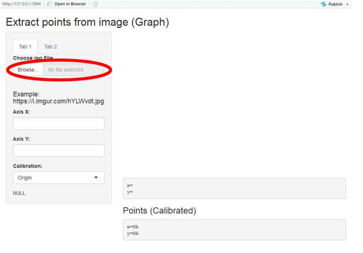

## Description

The aim of the shiny aplication developed is to extract data from images. For example, when you need the data from a graph and it is not available, the application will extract the points from the graph. 

## How to use the application (**Step 1**)

- Load the image.  
+ Click in the Browse and select your image file (jpg).
+ The example showed in this document can be found here [image](https://i.imgur.com/hYLWvdt.jpg)

## How to use the application (**Step 2**)

- Axis x: Write the value of a number in the X axis   
- Axis y: Write the value of a number in the Y axis (As showed below)  
+ In the calibration panel, select **Origin** and click in the origin point from the image.

## How to use the application (**Step 3**)
  
- In the calibration panel, select **X - Axis** and click in the X point in the X axis (As in the left figure below). For example: 3, the same point that you write in Step 2. 
- Select **Y - Axis** and click in the Y point in the Y axis. 12. 
- Finally, the model is calibrated and you can extract the points from the image. Next, select **Points** (Calibration panel) and select **Tab 2**, each time you click in a point you can see it in the table. 

